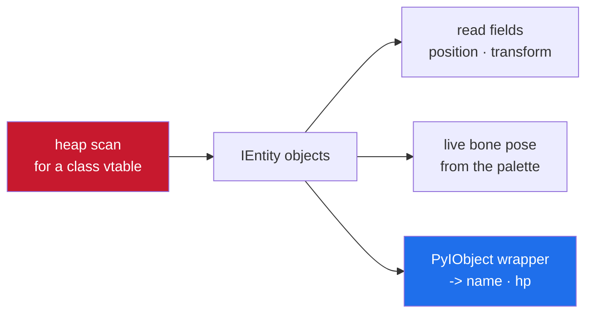

<h1 align="center">ios-messiah-re</h1>

<p align="center">reverse engineering NetEase's Messiah engine on iOS — an ECS with no GWorld, gameplay data in a Python layer, and telemetry anti-cheat</p>

<p align="center">
  
  
  
  
</p>

---

Notes on reverse engineering games built on NetEase's Messiah engine on iOS — the
counterpart to my [ios-ue4-re](https://github.com/shiedless/ios-ue4-re) series, for a
completely different engine. Almost everything Unreal taught me is the wrong shape
here.

Read-only and analysis-oriented. No memory writes, no bypass. The anti-cheat part
stops at understanding, same as my ACE note.

---

## the shape of it

Read the heap, find objects by their vtable, read their fields, cross into Python for
names. That's the whole workflow.



---

## nothing transfers from UE4

If you come from Unreal, your instincts are all wrong here.

| you expect (UE4) | Messiah reality |
|------------------|-----------------|
| `GWorld` → an actor array to walk | no global list — find objects by vtable |
| `GNames` / `FName` → string | names live in the Python layer |
| `ProcessEvent` funnel | gameplay is Python 3.11 bytecode |
| fixed struct offsets | reflection registry — offsets aren't static |
| one object model | two — C++ and Python, bridged by wrappers |

---

## the one trick that unlocks everything

There's no list to walk, so you find objects by what they are. A C++ object's first
qword is its vtable pointer — and under the Itanium ABI that value is
`vtable_symbol + 0x10`, past `offset_to_top` and `typeinfo`. Scan the malloc heap for
that qword and every hit is an instance.

| step | detail |
|------|--------|
| name the class | C++ RTTI is intact — find `N7Messiah7IEntityE`, follow it to the vtable |
| compute the target | `base + vtable_rva + 0x10` (scan for the symbol itself and you match nothing) |
| scan | walk vm regions, keep malloc-tagged RW non-exec pages, compare every aligned qword |
| read safely | `vm_read_overwrite`, not a raw load — the ECS frees objects constantly |

Plain arm64, no PAC, so a raw qword compare works. On arm64e you'd strip the pointer
authentication code first.

---

## naming everything with RTTI

Follow a mangled name to its `typeinfo`, then to the vtable — and the functions in
that vtable are that class's methods. The binary goes from a sea of `sub_100xxxxx` to
a named type hierarchy, which is what makes everything below possible.

Only characters carry a `CharCtrlComponent`. Find those, follow each back to its owner
`IEntity`, and you've split players from the hundreds of scenery entities with no
heuristics.

---

## the camera

Recover `PerspectiveCamera` from its own vtable, not from the first matrix-shaped
thing you find.

| from | you get |
|------|---------|
| `SetView` | the basis — `right` / `up` / `back` (camera looks along `-back`) and the `eye` |
| the projection builder | a GL column-major 4×4; you need `P00`, `P11`, two skew terms |
| `P[2][3] == -1` | a sanity check that you're reading a real projection matrix |

World-to-screen then uses the game's real projection instead of a guessed FOV, which
is what keeps boxes glued to targets as the camera turns.

---

## the skeleton: bind pose vs live pose

The bone array off the component is the shared bind pose — read it and every character
stands in a frozen T-pose. The live animated pose is one indirection further, in a
per-instance palette. `GetBoneWorldTransform` composes `world × local`, where the
local bone matrix comes from that palette.

Bones are keyed by a hash of their name, which is also how you attach meaning to
joints — match "head", "pelvis", "l/r thigh" by reading each bone's name once per rig.

Honest caveat: LOD-culled rigs hold the bind pose in their palette, so "some
characters don't animate" is expected engine behaviour, not a wrong offset.

---

## the Python layer

Names, health and team aren't native fields — they're Python 3.11 objects. Native
getters go through a reflection registry, which is why there's no static offset to
find. The bridge is a `PyIObject` wrapper that holds the native entity pointer: find
the wrapper whose native pointer equals your entity, then walk its CPython managed
dict — attributes come out as Python `str`, decoded per the 3.11 compact-string
layout.

You never run Python. You read its heap the same way you read the C++ heap — you just
need the `PyObject` / `PyTypeObject` / dict layout for the exact interpreter version.

---

## the anti-cheat: NTHunter

The game ships NetEase NTHunter (CrashHunter). The thing to understand, and why this
stays analysis, is that here it's telemetry, not active-kill — no brk/ptrace trap
terminates the process. It gathers device state into one report and sends it: a
jailbreak file-path check, a `sysctl` `P_TRACED` debugger check, and a substrate
image-name scan, each written into one device-fingerprint struct alongside benign
fields.

The lesson is to know what kind of anti-cheat you're looking at before theorising — a
telemetry model and an active-kill model need completely different reasoning, and
mistaking one for the other wastes days. This stops at the model, the same place my
[ACE note](https://github.com/shiedless/tencent-ace-anogs-notes) does.

---

## what you need

| | |
|---|---|
| device | a jailbroken iOS device to run and dump on |
| static | IDA, Ghidra or Binary Ninja with a working C++ RTTI demangler |
| background | ARM64, the C++ Itanium ABI, and enough CPython to recognise a `PyObject` |

The Itanium ABI and the CPython object layout do more work here than any
engine-specific trick.

---

## notes

For learning how Messiah is put together. The anti-cheat section stops at
understanding on purpose — no overlay, no writes, no bypass. Notes, not attacks.

MIT.

---

<p align="center">— shiedless</p>
```
